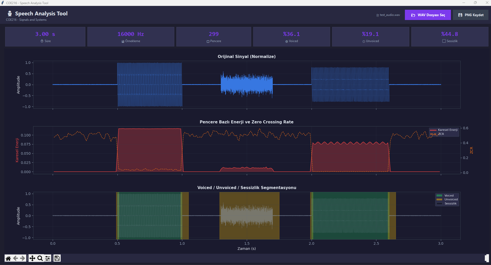

# 🎙 Speech Analysis Tool

> **COE216 — Signals and Systems** | Voice Activity Detection & Voiced/Unvoiced Classification

A modern, dark-themed desktop application that analyzes `.wav` audio files to detect speech regions, classify them as **Voiced** or **Unvoiced**, and visualize the results in real time — all with a single click.



---

## ✨ Features

| Feature | Description |
|---------|-------------|
| **📂 WAV File Picker** | Select any `.wav` file via a native file dialog |
| **🔍 Voice Activity Detection** | Adaptive threshold + hangover + median filter pipeline |
| **🟢🟡 Voiced / Unvoiced Classification** | ZCR + Energy based logical classifier |
| **📊 Real-time Statistics** | Duration, sample rate, frame count, V/UV/Silence percentages |
| **🎨 Dark-Theme Plots** | 3-panel matplotlib visualization embedded in the GUI |
| **🔊 Speech Export** | Save speech-only regions as a new `.wav` file with silence removed |
| **💾 PNG / SVG / PDF Export** | Save analysis plots in publication-quality formats |
| **🔧 Zero External Audio Deps** | Uses Python's built-in `wave` module — no `librosa` or `soundfile` needed |

---

## 🖥 Dashboard Overview

The application renders three synchronized panels:

1. **Original Signal** — Normalized waveform in the `[-1, 1]` range
2. **Energy & ZCR** — Per-frame Squared Energy (red) and Zero Crossing Rate (orange dashed)
3. **Segmentation Mask** — Waveform overlaid with colored regions:
   - 🟢 **Green** → Voiced (vowels like A, O, U)
   - 🟡 **Yellow** → Unvoiced (fricatives like S, Ş, F)
   - ⬜ **Empty** → Silence

---

## 🚀 Quick Start

### Prerequisites

- Python 3.10+
- A working Tkinter installation (included with most Python distributions)

### Installation

```bash
git clone https://github.com/furkanturandev/Speech-Analysis-Tool.git
cd Speech-Analysis-Tool
pip install -r requirements.txt
```

### Run

```bash
python speech_analysis.py
```

Then click **"📂 WAV Dosyası Seç"** to select your `.wav` file — analysis starts automatically.

---

## 📦 Dependencies

| Package | Purpose |
|---------|---------|
| `numpy` | Array operations, signal math |
| `scipy` | Median filter (`scipy.signal.medfilt`) |
| `matplotlib` | Plotting engine + Tkinter embedding |
| `tkinter` | GUI framework (Python built-in) |
| `wave` | WAV file I/O (Python built-in) |

---

## ⚙️ Signal Processing Pipeline

```
┌──────────────┐    ┌─────────────┐    ┌────────────────────┐    ┌──────────────┐
│  Load WAV    │───▶│  Framing    │───▶│  VAD Pipeline      │───▶│  V/UV        │
│  Normalize   │    │  20ms       │    │  Energy + Threshold │    │  Classifier  │
│  [-1, 1]     │    │  Hamming    │    │  Hangover + Median  │    │  ZCR-based   │
│              │    │  50% overlap│    │                    │    │              │
└──────────────┘    └─────────────┘    └────────────────────┘    └──────────────┘
```

### Configurable Parameters

| Parameter | Default | Description |
|-----------|---------|-------------|
| `FRAME_MS` | `20` | Window length in milliseconds |
| `OVERLAP_RATIO` | `0.50` | 50% overlap between consecutive frames |
| `NOISE_DUR_MS` | `200` | First 200 ms treated as noise reference |
| `ENERGY_MULT` | `3.0` | Adaptive threshold multiplier (μ + k·σ) |
| `HANGOVER_FRAMES` | `4` | Frames to hold speech label after offset |
| `MEDIAN_KERNEL` | `7` | Median filter kernel size (odd number) |
| `ZCR_THRESHOLD` | `0.10` | ZCR boundary for Voiced vs Unvoiced |

---

## 🧪 Test with Synthetic Audio

A test WAV generator is included for quick testing:

```bash
python generate_test_wav.py
```

This creates a `test_audio.wav` with known structure:

| Time Range | Content |
|------------|---------|
| 0.0 – 0.5s | Silence |
| 0.5 – 1.0s | Voiced (150 Hz — vowel "A") |
| 1.0 – 1.3s | Silence |
| 1.3 – 1.7s | Unvoiced (white noise — "S/F") |
| 1.7 – 2.0s | Silence |
| 2.0 – 2.6s | Voiced (120 Hz — vowel "O") |
| 2.6 – 3.0s | Silence |

---

## 📁 Project Structure

```
Speech-Analysis-Tool/
├── speech_analysis.py          # Main application (GUI + signal processing)
├── generate_test_wav.py        # Synthetic test WAV generator
├── requirements.txt            # Python dependencies
├── analysis_dashboard.png      # Dashboard screenshot
├── test_audio.wav              # Generated test audio
├── test_audio_speech_only.wav  # Exported speech-only audio
└── README.md                   # This file
```

---

## 📝 Technical Notes

**Why Squared Energy over RMS?**
Squaring amplifies high-energy speech peaks relative to low-energy noise, increasing contrast and making threshold decisions more robust — without the computational cost of a square root.

**Why Adaptive Threshold?**
A fixed threshold fails across different recording environments. The adaptive method `θ = μ_noise + k · σ_noise` automatically adjusts to ambient noise levels using the first 200 ms as a reference.

**Why 50% Overlap?**
Hamming windows suppress frame edges to near-zero. Without overlap, information at frame boundaries is lost. 50% overlap ensures every sample is fully represented in at least one frame center.

---

## 📄 License

This project was developed for the **COE216 — Signals and Systems** course.

---

<p align="center">
  Made with ❤️ using Python, NumPy, and Matplotlib
</p>
